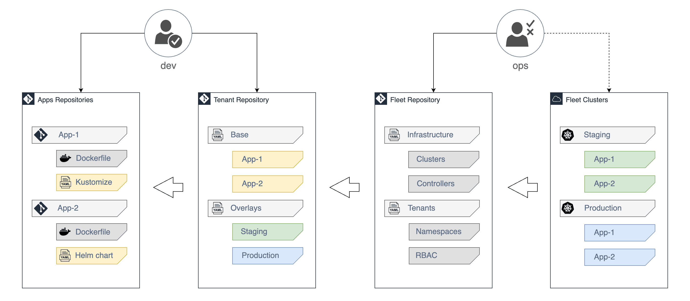

# Audi Monitoring Team Demo

Dieses Repository beinhaltet nur die Services, die in den Stages deployt werden sollen.
Das Repository kann in Github oder auf einer anderen Plattform privat gesetzt sein.
Für ein privates Repository braucht FluxCD einen Token oder SSH-Key als Authentifizierung.

Jedes Team kann sein eigenes Repository bekommen, (ggf. Teams IPO, A&F, CP, Next und COM),
es beinhaltet das Team Monitoring als ein Beispiel. Das Team Monitoring kann den Kubernetes Prometheus Monitoring Stack als Helm Chart auf dem FluxCD Cluster deployen, aber es ist zurzeit wegen des hohen Ressourcenverbrauches in einer Demo-Umgebung deaktiviert.
